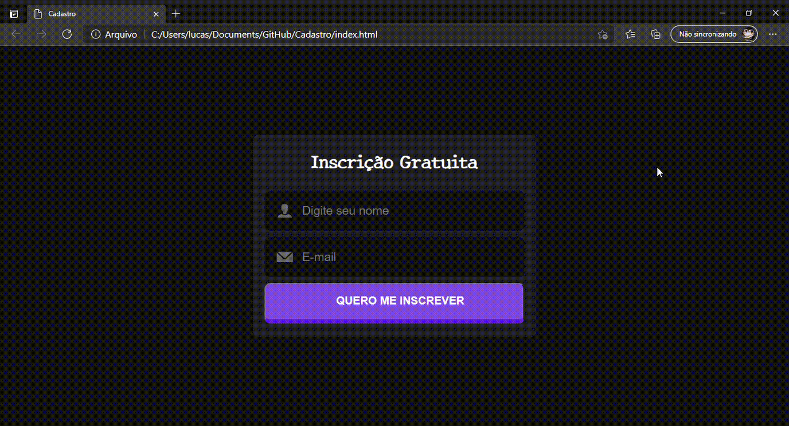

### Cadastro
 
Está página cadastro foi desenvolvida para fixar e colocar em prática os conhecimentos por mim adquiridos.

### Objetivo

Está página tem como objetivo realizar o cadastramento de usuários para eventos/workshops onlines através do nome e e-mail.

### Demonstração

### Tecnologias

* HTML5
* CSS3

### Sites

Segue abaixo a lista de referência dos sites utilizados para implantar este projeto:

Icons8: https://icons8.com/

W3schools: https://www.w3schools.com/css/default.asp
